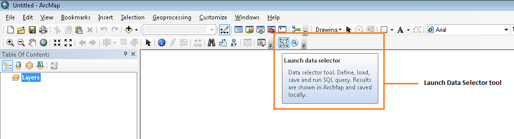
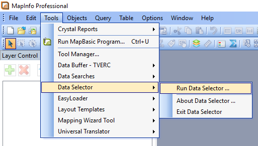
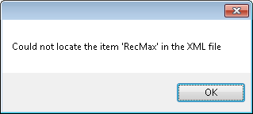
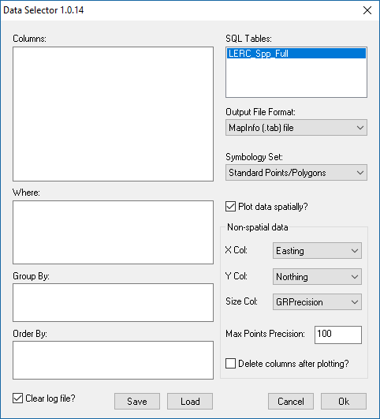
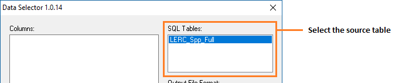
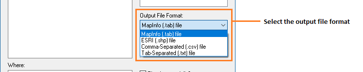
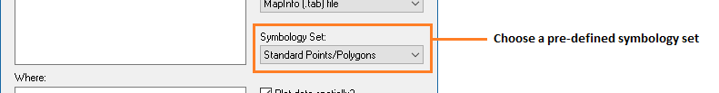
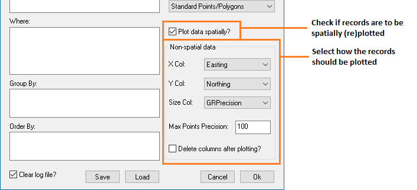
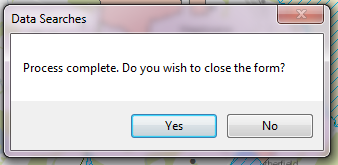
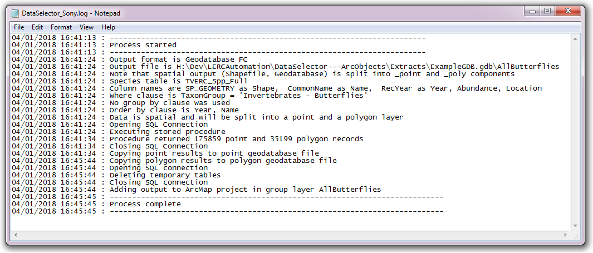

.. index::
	single: Running the tool

****************
Running the tool
****************

Instructions
------------
- Specifying SQL clauses
- Selecting output format
- Choosing output destination
- Note: GIS layers will automatically be loaded, csv/txt files will not (as the assumption is they will be opened in another application)
- Hit go
- Explain what it does at this point.
- Note: overwrite of outputs

Worked example(s)
-----------------

Loading & saving queries
------------------------

Queries can be saved for future use, so once a query has been written and saved it can be loaded and re-run by any user at any time and it will output results from the most up-to-date copy of the database.

The operation of the Data Selector tool is explained in this section. While the interface is similar between the ArcGIS and MapInfo implementations of the tool, there are some differences. These are pointed out where relevant throughout this document.

As discussed in the :doc:`Setting up the tool <../setup/setup>` section, the Data Selector tool is operated from the GIS application. It relies on the SQL tables containing any data that may be selected and a configuration document for setting up the tool. Therefore, before running the tool, ensure the following conditions are met:

- The XML configuration document has been set up correctly and is named correctly.
- The Data Selector tool has been installed and set up.

.. seealso::
	Please refer to the :doc:`setup <../setup/setup>` section for further information about any of these requirements.

.. raw:: latex

   \newpage

.. index::
	single: Opening the form

Opening the form
================

To open the Data Selector tool in ArcGIS, click on the **Data Selector tool** button (:numref:`figLaunchArcGIS`).

.. _figLaunchArcGIS:

	Launching the Data Selector tool (ArcGIS)

To open the Data Selector tool in MapInfo, select **Tools... -> Data Selector** in the `Tools` menu (:numref:`figLaunchMapInfo`).

.. _figLaunchMapInfo:

	Launching the Data Selector tool (MapInfo)

.. raw:: latex

   \newpage

If there are any structural issues with the XML document, the tool will display a message with the error it has encountered, and not load any further.

.. _figLaunchWarningArcGIS:

	Example warning message displayed for any XML structural issues

.. raw:: latex

   \newpage

Provided that the XML document is otherwise correct, the form will display (:numref:`figDisplayFormMapInfo`).

.. _figDisplayformMapInfo:

	The form displaying the available SQL tables and options (MapInfo)

.. raw:: latex

   \newpage

.. index::
	single: Using the form

Using the form
==============

Select the required source table in the **SQL Tables** box (:numref:`figSelectSQLTableMapInfo`).

.. _figSelectSQLTableMapInfo:

	Select the required source table in the SQL tables list

Select the output file format to contain the selected records (:numref:`figSelectOutputFormatMapInfo`).

.. _figSelectOutputFormatMapInfo:

	Select the output file format

The following options are available in MapInfo:
* **MapInfo (.tab) file**
* **ESRI (.shp) file**
* **Comma-separated (.csv) file**
* **Tab-separated (.txt) file**

The following options are available in ArcGIS:
* **Geodatabase**
* **Shapefile**
* **Text file (tab delimited)**
* **CSV file**

.. raw:: latex

   \newpage

If you have selected 'MapInfo (.tab) file' as the output file format (only available in MapInfo) you can optionally also select one of the pre-defined symbology sets to apply to the output file (:numref:`figSelectSymbologySetMapInfo`). Symbology sets are specified in the configuration file

.. _figSelectSymbologySetMapInfo:

	Select a symbology set to apply to the records (MapInfo only)

If you have selected 'ESRI (.shp) file' (available in ArcGIS or MapInfo) or 'MapInfo (.tab) file' (available only in MapInfo) as the output file format you can optionally also select if the records should be spatially plotted or re-plotted (:numref:`figSelectSpatialPlottingMapInfo`).

.. _figSelectSpatialPlottingMapInfo:

	Select a symbology set to apply to the records (MapInfo only)

Next, select the buffer size and units in the Buffer Size and Buffer Units boxes (:numref:`figBufferSettingsArcGIS`). The buffer size box accepts decimal points. A buffer size of zero (0) is acceptable, however in ArcGIS the tool will create a buffer polygon of 0.01 metres if a zero buffer size is specified, in order for the buffer layer to be symbolised correctly.

.. _figBufferSettingsArcGIS:

.. figure:: figures/BufferSettingsArcGIS.png
	:align: center

	Select the buffer size and units you wish the search to use.

.. raw:: latex

   \newpage

Decide whether you wish to add the results of the search to the screen and select the relevant option in the 'Add Selected Layers to Map' drop-down box. There are three options (:numref:`figLayerSettingsArcGIS`):

.. _figLayerSettingsArcGIS:

.. figure:: figures/AddLayerSettingsArcGIS.png
	:align: center

	Select how results should be added to the map, if at all

- **No** ... Layers will not be added to the map.
- **Yes - Without labels** ... Layers will be added to the map but will not be labelled.
- **Yes - With labels** ... Layers will be added to the map and will be labelled.

When either of the 'Yes' options is selected, layers will be added to the map in accordance with the settings that are given for each map layer in the configuration document. 

.. note:: 
	If the KeepLayer attribute is set to ``No`` for an individual layer, it will not be added to the map even if the user selects a 'Yes' option in the drop-down list.

.. raw:: latex

   \newpage

If you have selected 'Yes - With labels', select how labels should be added in the 'Overwrite Map Labels' drop-down box (:numref:`figLabelSettingsArcGIS`). If you have made a different selection in the 'Add Selected Layers to Map' drop-down box, any settings in the 'Overwrite Map Labels' will be ignored. There are three options: 

.. _figLabelSettingsArcGIS:

.. figure:: figures/LabelSettingsArcGIS.png
	:align: center

	Select how labels should be added to the map, if at all

- **No** ... Existing map labels will not be overwritten. However, new map labels will be created if the map label column given in the configuration document doesn't exist.
- **Yes - Reset Counter** ... Labels will be numbered from 1 and increase by 1 for each feature.
- **Yes - Increment Counter** ...  Labels will be numbered from 1 and increase by 1 for each feature, but the counter will increase incrementally for all the layers (i.e. it will not reset to 1 at the start of each layer).

.. note::
	Map layers will be labelled in accordance with the settings that are given for each map layer in the configuration document. These settings can override the above options in the following circumstances:

	- If no 'LabelColumn' is given in the configuration file, the map layer will not be labelled in any circumstance.
	- If the 'OverwriteLabels' attribute is set to ``No``, the labels for this map layer will not be overwritten even if requested by the user.

.. note::
	If no default values have been given in the XML file for 'DefaultAddSelectedLayers', 'DefaultOverwriteLabels' or 'DefaultCombinedSitesTable', the drop-downs relating to these options will **not show on the form**. In this case, no layers will be added, no labels overwritten, and no combined sites table created, respectively.

.. raw:: latex

   \newpage

Decide how the combined sites table should be created by selecting the relevant option in the 'Create Combined Sites Table' drop-down box. There are three options (:numref:`figCombinedSitesArcGIS`):

.. _figCombinedSitesArcGIS:

.. figure:: figures/CreateCombinedSitesArcGIS.png
	:align: center

	Select how the combined sites table should be created

- **None** ... No combined sites table will be created. Any existing combined sites table for this search reference will be retained.
- **Append to existing table** ... Records will be appended to the combined sites table (if it already exists), otherwise a new combined sites table will be created.
- **Overwrite existing table** ... Records will be saved to a new combined sites table. If a combined sites table already exists it will be deleted first.

.. raw:: latex

   \newpage

Finally, select whether the log file should be cleared before the process runs by checking or unchecking the 'Clear Log File' check-box (:numref:`figClearLogFileArcGIS`).

.. _figClearLogFileArcGIS:

.. figure:: figures/ClearLogFileArcGIS.png
	:align: center

	Select option for clearing the log file

Click **OK** for the search process to start.

While the Data Selector tool is running the search, the map interface will become inactive (in ArcGIS the screen will show 'Paused'). Once the process is finished the interface will reactivate.

When the search is finished, a message box will appear (:numref:`figFinishedArcGIS`). If you would like to rerun the search (for example, for different data layers, or for a different buffer size), choose to keep the form open and it will retain the information as it was entered for the last search.

.. _figFinishedArcGIS:

	Prompt to close the form when the search process completes

.. raw:: latex

   \newpage

Once you have made your choice, the log file will be shown using Notepad (:numref:`figLogFileArcGIS`). Using this you can review whether the search was carried out as expected. When you are finished, close the log file. It has already been saved in the analysis folder for future reference.

.. _figLogFileArcGIS:

	Example log file shown for review

You can now repeat the search process using a different search radius with different data layers, or for a different search request, as required.

.. _OverwriteWarning:

.. caution:: 
	If you rerun the search process using the **same search reference**, for example with a different buffer size, it is possible that some outputs will overwritten, or duplicated, as follows:

	- Output tables and GIS layers will be overwritten if the same map layer is included in a second search. Only one copy of each output table and / or GIS layer can be saved for the same search reference.
	
	- The combined sites table will be overwritten if **Overwrite existing table** is selected in the 'Create Combined Sites Table' option.

	- Combined sites records will be duplicated if the same map layer is included in a second search and if **Append to existing table** is selected in the 'Create Combined Sites Table' option.

.. raw:: latex

   \newpage

.. index::
	single: Output results

Output results
==============

When the selection is finished the output GIS layer or text file will be saved with the name, and in the folder, specified by the user before the process started. If the output is in a GIS format native to the GIS application (.tab files for MapInfo or .shp files for ArcGIS)

and the log file are all saved in the 'GISFolder' specified in the XML document. Any saved GIS layers resulting from the search are also added to the map interface (if requested).

.. note::
	Only results for those layers for which features were found within the search radius are saved and added to the map.

.. raw:: latex

   \newpage

.. index::
	single: Search results; ArcGIS

Search results in ArcGIS
------------------------

In ArcGIS, search results are added to the current document as follows:

- If 'Yes' is selected in the 'Add Selected Layers to Map' search option, each saved GIS layer (where 'Yes' is selected in the 'KeepLayer' attribute in the configuration) is added to a new group layer. The name of the group layer follows the short search reference format, with any special characters replaced with the 'RepChar' specified in the XML document (e.g. '2016/001' becomes '2016 001').

- If either 'Yes - with labels' or 'Yes - without labels' are selected in the 'Add Selected Layers to Map' search option and, if a layer file name is specified in the 'LayerFileName' attribute in the configuration for a saved layer, symbology is applied to that layer using the specified layer file.

- If 'Yes - with labels' is selected in the 'Add Selected Layers to Map' search option and, if a column name is specified in the 'LabelColumn' attribute in the configuration for a saved layer, labels are applied to that layer (as specified in the configuration using the 'LabelClause' attribute).

- A buffer GIS layer, created during the search, will be added to the new group layer and symbology will be applied using the appropriate layer file (as specified in the configuration using the 'BufferLayerName' general attribute).

- Unless the buffer radius specified is zero, the map will zoom to the extent of the buffer layer that was created during the search.

An example of how the results will appear in ArcGIS is shown in :numref:`figResultsArcGIS`.

.. _figResultsArcGIS:

.. figure:: figures/ResultsArcGIS.png
	:align: center

	Example results from search process (ArcGIS)

.. raw:: latex

   \newpage

.. index::
	single: Search results; MapInfo

Search results in MapInfo
-------------------------

In MapInfo, search results are added to the active workspace as follows:

- If 'Yes' is selected in the 'Add Selected Layers to Map' search option, each saved GIS layers (where 'Yes' is selected in the 'KeepLayer' attribute in the configuration) is added to **all** map windows that contain the relevant source layer. This means that if there are multiple map windows open in the workspace containing the same source layer the saved GIS layer will be added to each of those map windows.

- If 'Yes - with labels' is selected in the 'Add Selected Layers to Map' search option and, if a column name is specified in the 'LabelColumn' attribute in the configuration for a saved layer, labels are applied to that layer (as specified in the configuration using the 'LabelClause' attribute).

- A buffer GIS layer, created during the search, will be added to **all** map windows.

- The map will zoom to the extent of the buffer layer that was created during the search.

An example of how the results will appear in MapInfo is shown in :numref:`figResultsMapInfo`.

.. _figResultsMapInfo:

.. figure:: figures/ResultsMapInfo.png
	:align: center

	Example results from search process (MapInfo)
