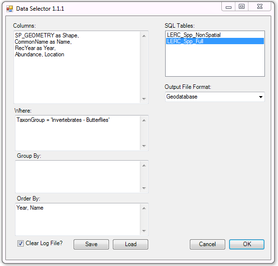

.. index::
	single: Running the tool

****************
Running the tool
****************

Instructions
------------

The operation of the Data Selector tool is explained in this section. While the interface is similar between the ArcGIS and MapInfo implementations of the tool, there are some differences. These are pointed out where relevant throughout this document.

As discussed in the :doc:`Setting up the tool <../setup/setup>` section, the Data Selector tool is operated from the GIS application. It relies on the SQL tables containing any data that may be selected and a configuration document for setting up the tool. Therefore, before running the tool, ensure the following conditions are met:

- The XML configuration document has been set up correctly and is named correctly.
- The Data Selector tool has been installed and set up.

.. seealso::
	Please refer to the :doc:`setup <../setup/setup>` section for further information about any of these requirements.

.. raw:: latex

   \newpage

.. index::
	single: Opening the form

Opening the form
================

To open the Data Selector tool in ArcGIS, click on the **Data Selector tool** button (:numref:`figLaunchArcGIS`).

.. _figLaunchArcGIS:

.. figure:: figures/LaunchSelectorToolArcGIS.png
	:align: center

	Launching the Data Selector tool (ArcGIS)

To open the Data Selector tool in MapInfo, select **Tools... -> Data Selector** in the `Tools` menu (:numref:`figLaunchMapInfo`).

.. _figLaunchMapInfo:

	Launching the Data Selector tool (MapInfo)

.. raw:: latex

   \newpage

If there are any structural issues with the XML document, the tool will display a message with the error it has encountered, and not load any further.

.. _figLaunchWarningArcGIS:

.. figure:: figures/LaunchWarningArcGIS.png
	:align: center

	Example warning message displayed for any XML structural issues

.. raw:: latex

   \newpage

Provided that the XML document is otherwise correct, the form will display (:numref:`figDisplayFormMapInfo`).

.. _figDisplayformMapInfo:

.. figure:: figures/DisplayFormMapInfo.png
	:align: center

	The form displaying the available SQL tables and options (MapInfo)

.. raw:: latex

   \newpage

.. index::
	single: Using the form

Using the form
==============

Select the required source table in the **SQL Tables** box (:numref:`figSelectSQLTableMapInfo`).

.. _figSelectSQLTableMapInfo:

	Select the required source table in the SQL tables list

Select the output file format to contain the selected records (:numref:`figSelectOutputFormatMapInfo`).

.. _figSelectOutputFormatMapInfo:

.. figure:: figures/SelectOutputFormatMapInfo.png
	:align: center

	Select the output file format

The following options are available in MapInfo:

* **MapInfo (.tab) file**
* **ESRI (.shp) file**
* **Comma-separated (.csv) file**
* **Tab-separated (.txt) file**

The following options are available in ArcGIS:

* **Geodatabase**
* **Shapefile**
* **Text file (tab delimited)**
* **CSV file**

.. raw:: latex

   \newpage

If you have selected 'MapInfo (.tab) file' as the output file format (only available in MapInfo) you can optionally also select one of the pre-defined symbology sets to apply to the output file (:numref:`figSelectSymbologySetMapInfo`). Symbology sets are specified in the configuration file

.. _figSelectSymbologySetMapInfo:

	Select a symbology set to apply to the records (MapInfo only)

If you have selected 'ESRI (.shp) file' (available in ArcGIS or MapInfo) or 'MapInfo (.tab) file' (available only in MapInfo) as the output file format you can optionally also select if the records should be spatially plotted or re-plotted (:numref:`figSelectSpatialPlottingMapInfo`). In ArcGIS, the records are automatically plotted if a geometry field is included.

.. _figSelectSpatialPlottingMapInfo:

	Select a symbology set to apply to the records (MapInfo only)

Finally, select whether the log file should be overwritten, and whether the spatial columns should be deleted after use (MapInfo only). Now the form is set up to enter and run your query.

Entering queries
================

Specify the columns and SQL clauses that you wish to use to query the selected table. All syntax should adhere to SQL Server SQL syntax, and it is important that the correct part of the query is entered in the correct text box. Bear in mind when writing your query that the tool is designed to run a SELECT query only, and that it will not execute an action query. Simply enter the columns you wish to select in the ``Columns`` box, including any changes in name (e.g. ``CommonName as Name``), your selection clause in the ``Where`` box, and your Group By and Order By clauses in their relevant boxes as appropriate. A number of examples are shown in :numref:`figExample1` (a simple query including geometry), :numref:`figExample2` (a spatial query using grouping) and :numref:`figExample3` (a non-spatial, or tabular, query).

.. note::
	If a Group By clause is included for a query that includes a spatial element, the geometry must be grouped too using SQL specific syntax (see :numref:`figExample2` for an example using an aggregate function).

.. note::
	It is not necessary to include key words such as ``SELECT``, ``WHERE``, ``GROUP BY`` and ``ORDER BY``. Doing so will make the tool fail.

.. _figExample1:

	Example of a simple query using geometry (ArcGIS)

.. _figExample2:

	Example of a query using spatial grouping (ArcGIS)

If no spatial element is selected in the query, the output will be tabular. An example of such a query is shown in :numref:`figExample3`, where a simple report is generated of the number of records for each taxon group.

.. _figExample3:

	Example of a summary query with tabular output (ArcGIS)

Running the query
=================

Once the correct query has been entered and the output format selected, and the plotting and symbology defined (MapInfo only), check whether the log file should be overwritten using the ``Clear Log File`` check box. Then, click `OK`. You will be prompted for an output file (:numref:`figDefineOutput`). Enter a name for your output and click `Save`. If an existing file is selected, the tool will prompt you for permission to overwrite this, or to choose a different name. Once the output name has been selected the tool will begin the process.

.. _figDefineOutput:

	Enter the name for your output file.

Depending on which version of the tool you are using, and whether you are generating a spatial or a tabular output, the output will be created and shown as follows:

* If you are using **MapInfo** and are creating a **spatial** output layer, it will be added to the view and shown.
* If you are using **ArcGIS** and are creating a **spatial** output layer, it will be split into point and polygon layers as required and added to the view in a grouped layer.
* If you are using **MapInfo** and are creating **tabular** output in **CSV or TXT** format, it will not be added to the view.
* If you are using **ArcGIS** and are creating **tabular** output, or **MapInfo** and creating **tabular** output in **.tab** format, it will be added to the view and shown.

An example of spatial and tabular outputs in ArcGIS is shown in :numref:`figSpatialOutput` and :numref:`figTabularOutput`. 

.. _figSpatialOutput:

	Example output from a spatial query (ArcGIS; Zoomed in to maintain confidentiality)

.. _figTabularOutput:

	Example output from a non-spatial query (ArcGIS)

Once the process has finished, a messagebox will ask you whether you wish to close the form (:numref:`figCloseForm`). After you have made your choice the log file is shown (:numref:`figLogFile`) so you can check the process has completed correctly, and the results will be added to the screen as discussed above. Note that the log file entries are different between ArcGIS and MapInfo versions.

.. _figCloseForm:

.. figure:: figures/FinishedArcGIS.png
	:align: center

	User is asked whether the form should be closed after the process finishes

.. _figLogFile:

.. figure:: figures/LogFileArcGIS.png
	:align: center

	The log file is shown when the process finishes (ArcGIS)

Loading & saving queries
------------------------

Queries can be saved for future use, so once a query has been written and saved it can be loaded and re-run by any user at any time and it will output results from the most up-to-date copy of the database.

Queries can be saved or loaded by using the ``Save`` and ``Load`` buttons (:numref:`figSaveAndLoad`). They are saved as a simple text file with minimal formatting.

.. _figSaveAndLoad:

.. figure:: figures/SaveLoadQueriesMapInfo.png
	:align: center

	Save and load queries (MapInfo)

