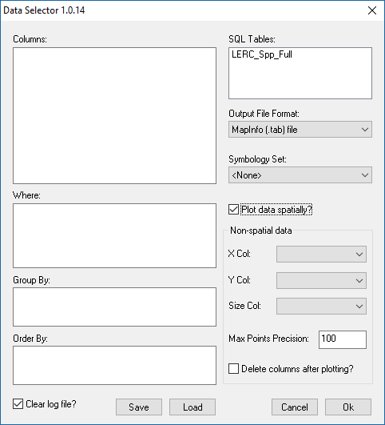

************
Introduction
************

.. index::
	single: Background

Background
==========

Many LERCs use Recorder 6 for entering, collating and querying records of species and habitats. Recorder 6 is a very versatile system and is the package of choice within the LERC community where efficiency, flexibility and scalability are critical. For querying data it not only has an inbuilt Report Wizard which will produce reports from the most common data tables, but it also comes with a reporting system (XML reports) which can be used to report on all tables in the database, either by running one of the extensive selection of XML reports installed with Recorder 6 or by adapting an existing XML report or writing your own.

However, although the Recorder database structure is well documented it is very complex and requires time and expertise to master it - this can make it appear complicated for many users. One solution is to create an SQL script that exports all of the regularly used data from the complex Recorder 6 tables into one or more simplified SQL database tables (currently MapInfo or ArcGIS). These tables can then be used for both standard and bespoke reporting and analysis, and more importantly can be used to plot the data as points and/or polygons for use directly in a GIS application.

.. Note::
	The Recorder database structure is based on the NBN data model which is documented in the Documentation Wiki on the `Recorder web site <www.jncc.gov.uk/recorder>`_.

To facilitate the querying of data from these new simplified tables a new interface was developed - the **Data Selector** tool. The Tool was originally developed for use with MapInfo for Greenspace Information for Greater London (GiGL) but is now available for use with both MapInfo and ArcGIS and is used by a number of LERCs.

.. raw:: latex

   \newpage

.. index::
	single: Tool overview

Tool overview
=============

The Data Selector Tool presents a simple user interface to extract information from Recorder 6 based on the selection criteria and desired format specified by the individual user. It is integrated into the user interface of the installed GIS application (currently MapInfo or ArcGIS) - appearing as a button or menu item. The tool itself has a simple interface (:ref:`figUI`), requiring a minimum of input (a set of SQL clauses to be used in the selection, an output format and an output file destination are the only required items). Once set up, the tool communicates with both the GIS system and an associated SQL database to extract the required data. The output files can be created as MapInfo TAB format (.tab) files or ESRI shapefile (.shp) files (depending upon the installed GIS application), Comma Separated Value (.csv) files or plain Text (.txt) files.

.. _figUI:

	The Data Selector tool interface

Queries used in the tool can be saved and loaded so they can be used again-and-again and run by all users. When the tool runs the query entered by the user will be passed to SQL Server to be executed against the selected SQL table. Any errors in the syntax of the query will be displayed in a pop-up message. The results of a successful execution will be saved in the required format and, if the output is a MapInfo .tab file a symbology will be applied to the records if required. The tool also generates a log of the execution results which details the steps that were taken during the process and the number of records selected and output. The process is discussed in this document in the section on :doc:`using the tool <../execute/execute>`_.

.. raw:: latex

   \newpage

Defining the default values for some options in the tool is done via a configuration document written in XML. Using this document the user can configure:
* The default location of the output folder and the default output format.
* The location of the default folder for saving and loading queries.
* The default columns used for plotting non-spatial data, or re-plotting already spatial data (MapInfo version only).
* Definitions of different sets of symbology to apply to output .tab files and the default set to use (MapInfo version only).

Using this configuration file, each individual LERC can tailor the Data Selector Tool to its individual requirements. Examples of the XML file are included in the :doc:`Appendix <../appendix/appendix>`_, and the process of setting up this file is discussed in the section on :doc:`setting up the tool <../setup/setup>`_. 

.. index::
	single: Benefits

Benefits
========

There are a number of clear benefits to using the Data Selector tool for carrying out data selections from Recorder6.

1. The tool enables the user to query and extract data directly from the Recorder6 database using a simple user interface within the GIS application without even needing to start the Recorder6 application.
#. Queries can be saved for future use which is particularly useful for increasing efficiency if a query is run on a regular basis.
#. Queries can be created by more experienced users in the LERC, or commissioned to be developed by a 3rd party, to meet specific requirements. It is even possible to share queries between LERCs (if based on a common set of attributes).
#. Query results can be plotted directly in GIS applications, as MapInfo (.tab) tables (MapInfo version only) and ESRI (.shp) shapefiles, for immediate visual and spatial analysis, as well as being output as spreadsheet (.csv) files and text (.txt) files.
#. The master SQL tables can be updated as and when required (for example, following a specific import of data or after amending or validating a set of records) or run on a regular basis by scheduling a task in SQL Server. This provides great control over when data is included in any data queries and extracts.
#. The format and content of the data in the SQL tables can be tailored to match each LERCs requirements and data holdings ensuring that only data that meets the necessary conditions is included in any queries and that data is presented exactly as expected.
