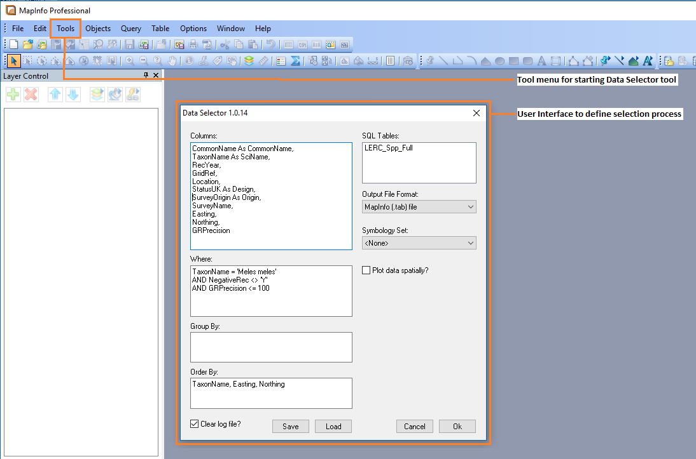
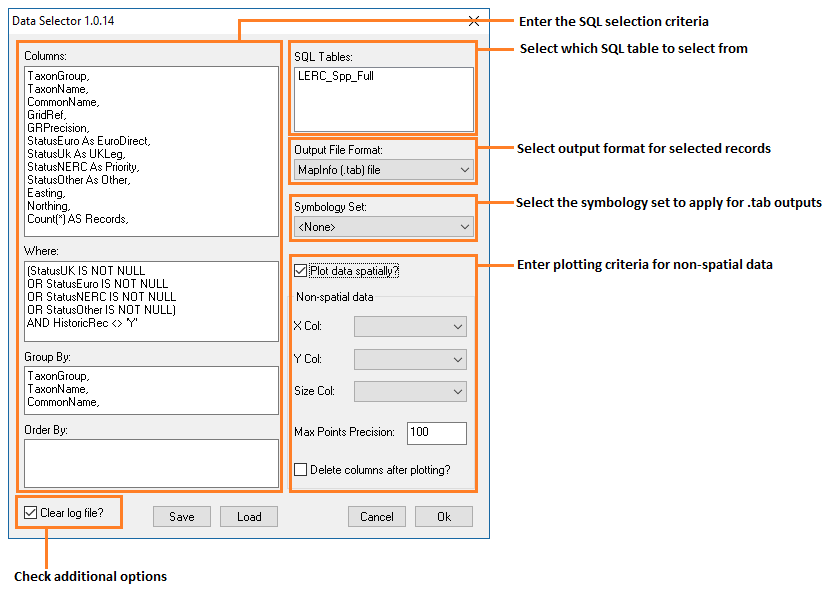
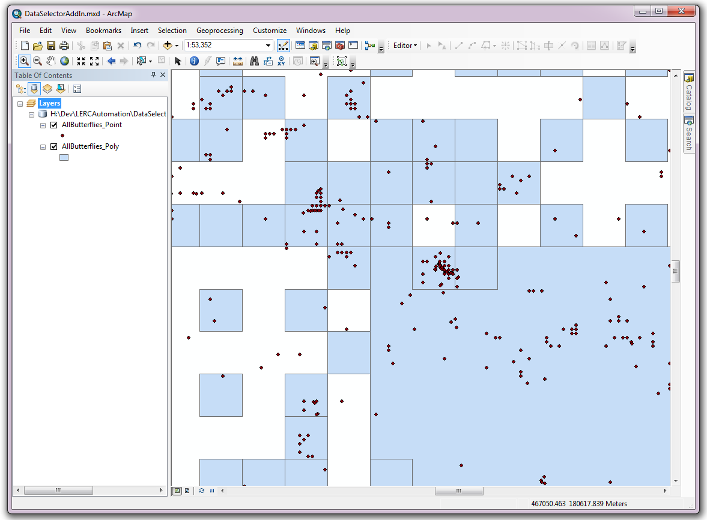
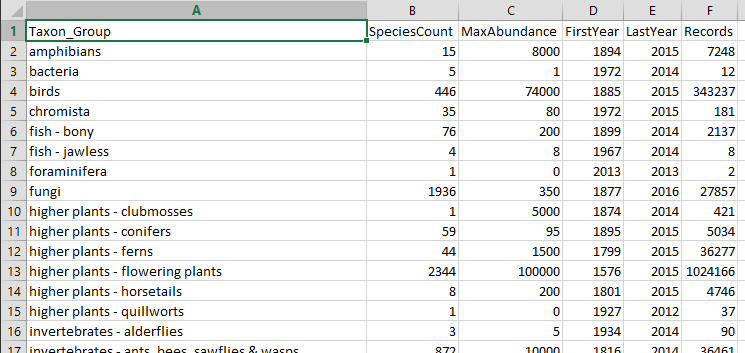
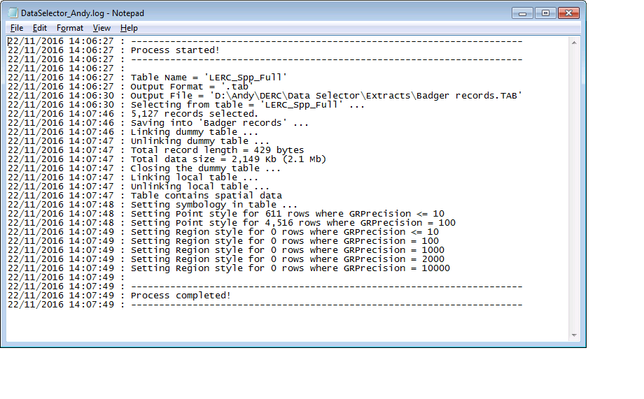

********************
Extending Recorder 6
********************

.. index::
	single: SQL Server

SQL Server
==========

Master Table
------------

In order for the Data Selector tool to be able to extract species records from Recorder6 a SQL script must be run periodically to create and update a master table in the Recorder6 database. The SQL script will be specific to your requirements based on a whole host of considerations. For example:

* Which columns/attributes to be defined in the table.
* Which surveys, events, samples and occurrences to include in the table.
* Whether any confidential surveys, species or occurrences should be included/excluded or flagged as confidential in the table.
* Whether any sensitive species should have their precision altered in the table.
* What species designations are to be included and how they should appear in the table (e.g. into which columns and using what abbreviations).
* How any occurrence abundance/counts and associated measurement qualifier/types should appear in the table.
* If zero abundance records are to be included in the table (in which case they would be clearly flagged as zero abundance).
* If a cut-off date for specific taxonomic groups or species is used to flag them as historic records.
* If the standard Recorder6 taxon group names or more bespoke group names are used (e.g. splitting ‘terrestrial mammal’ into 'Mammals - Terrestrial (bats)' and 'Mammals - Terrestrial (excl. bats)'.
* Whether unverified and/or unchecked records are included in the table.
* How record dates are to appear (e.g. as vague date range or as just single dates).
* If any specific records are to be flagged (e.g. bat records containing ‘roost’ or ‘hibern’ in any record/sample comments or measurements, or bird records containing ‘breed’, ‘bred’ or ‘nest’).

.. Note::
	Multiple master SQL tables, or multiple views on the same SQL table, can be created as required.

Spatial Data
------------

If your Recorder6 database is running on a more recent version of SQL Server (i.e. SQL Server 2008 or later) then it supports 'Geometry' and 'Geography' spatial data type. In this case the master table can also be 'spatialized' by setting the geometry for all records as points and/or polygons. This enables spatial queries to be performed within SQL Server rather than the GIS application thereby reducing the work load in GIS and utilising the likely increased performance capabilities of many servers running SQL Server.

In order to 'spatialize' the master table additional steps in the SQL script are run to calculate the geometry of all records based on their grid reference. The geometry can be calculated as points and/or polygons based on the requirements of the LERC and how the data will be used. Once spatialized, records from the master table can be directly plotted and viewed as points or polygons in GIS.  In addition, queries can be executed in SQL Server using the spatial location of the records in much the same way that spatial queries can be performed in GIS. This reduces the overheads in GIS and means that the number of records exported from SQL Server into GIS can be much reduced.

.. Note::
	If your Recorder6 database is running on an older version of SQL Server (i.e. SQL Server 2005 or earlier) then it does not support 'Geometry' and 'Geography' spatial data type. But don't worry, all is not lost! Although the master table cannot be 'spatialized', the records can optionally be plotted as points and/or polygons by the Data Selector tool in GIS if the selected output type is a .tab or .shp file (depending on the host GIS application).

.. index::
	single: Tool overview

The Data Selector tool
======================

Tool components
---------------

There are three component parts to the Data Selector tool that work together to automate the process described above:

1. Spatial data held in a SQL Server database (a stored procedure for its extraction is also required).
#. An XML configuration file that specifies how the tool is set up and how data will be saved by default.
#. The Data Selector tool itself.

The Data Selector tool is used within a GIS environment but it does not require any particular data layers to be preloaded in the GIS.

.. _figMapInfoUI:

	The Data Selector tool within the MapInfo environment

.. raw:: latex

   \newpage

Tool workflow
-------------

The Data Selector tool requires minimum user input in order to perform queries once it is configured. The simple workflow is as follows (see :numref:`figUIAnn`):

1. The user selects which SQL master table to query.
#. The user lists all the attributes (columns) from the selected SQL table to return (or enters '*' to return all attributes).
#. The user specifies any 'Where' selection criteria, if any, to apply when selecting records from the SQL table.
#. If required, the user can also specify any 'Group By' and 'Order By' criteria to apply when selecting records from the SQL table.
#. The user selects what output format should be created for the selected records.
#. Optionally, the user can choose one of the pre-defined symbology sets (only applicable for MapInfo .tab output files).
#. The user can also choose to spatially plot the data (or re-plot the data if it is already spatialized) as points and/or polygons.
#. There is also an option to clear the log file before use.
#. Once the user clicks **OK** the process starts.

.. _figUIAnn:

	The Data Selector tool workflow

In essence, the process that the tool follows is identical to the manual process a user would perform:

1. The required columns and records from the SQL table are selected based on the specified criteria.
#. The selected records are saved to the target file in the required output format.
#. If chosen, and the output file is a GIS layer, the records are spatially plotted as points and/or polygons.
#. If the output file is a MapInfo .tab file any chosen pre-defined symbology will be applied to the output records.
#. During the process the tool records its progress to a log file and, when the process finishes, this log file is displayed allowing the user to assess the success of the data selection.

.. raw:: latex

   \newpage

.. index::
	single: Tool outputs

Tool outputs
============

When the process finishes, the output is added to the GIS interface, either as a new GIS layer or as a non-spatial text table.

Output files
------------

When the tool is used in MapInfo, output GIS layers can be generated in MapInfo (.tab) format or converted into an ArcGIS (.shp) shapefiles. When used in ArcGIS the tool will output GIS layers as ArcGIS (.shp) shapefiles or as file- or personal-geodatabase feature classes. An example of the output the tool can generate is showin in :numref:`figGISOutput`.

.. _figGISOutput:

	Example of a GIS spatial output from the Data Selector tool

Text file outputs can be generated in CSV format (:numref:`figTabularOutput`) or TXT format. 

.. _figTabularOutput:

	Example of a text file output from the Data Selector tool

.. raw:: latex

   \newpage

Finally, the log file details each step that was taken during the process, and gives some feedback about the outcome of the process. This includes reporting on the chosen options for the selection, the number of records that were selected, if the output contains spatial data, and if any symbology was applied to the output table (:numref:`figLogFileExample`).

.. _figLogFileExample:

	Example of a Data Selector tool log file

The following chapters, :doc:`setting up the tool <../setup/setup>` and :doc:`running the tool <../execute/execute>`, will guide you through setting up and operating the tool in such a way that these tool outputs meet the general requirements of data selection within your organisation.
