*******************
Setting up the tool
*******************

Before the Data Selector tool will function, it needs to be installed and configured. It is recommended that the configuration is carried out first, although the steps are interchangeable for the ArcGIS implementation. 

.. index::
	single: Configuring the tool

Configuring the tool
====================

The configuration is stored in an XML file called 'DataSelector.xml', and there are some differences in the contents of this file between the MapInfo and the ArcGIS implementations of the tool. Please ensure that you are using the correct XML file, examples of both of which can be found in the :doc:`Appendix <../appendix/appendix>`. Attributes and settings are presented as nodes (beginning with a start node, e.g. ``<example>``, and finishing with an end note, e.g. ``<\example>``), with the value for the setting held between the ``<value>`` and ``<\value>`` tag. 

.. caution:: 
	The name of the configuration file must be 'DataSelector.xml'. The tool will not load if a different name is used.

The XML file can be edited in a text editor such as Notepad or Wordpad, or using a more feature rich XML editor such as as `Sublime Text <https://www.sublimetext.com/3>`_. The configuration file contains general attributes of the tool. The structure is roughly the same for both implementations of the tool. 

.. caution::
	It is important that the structure of the file is maintained as it is presented in the :doc:`Appendix <../appendix/appendix>`. Any changes to the structure may result in the Data Selector tool not loading, or not working as expected.

Once editing has been completed and the edits have been saved, it is recommended that the configuration file is opened using an internet browser such as Internet Explorer which will help highlight any editing errors – only if the structure of the file is valid will the whole file be displayed in the internet browser.

.. note::
	It is recommended that the configuration file is kept in a central (network) location, so that all users use the same configuration. Additionally, in case of the MapInfo implementation of the tool, it is essential that the configuration file is kept in the same folder as the compiled version of the tool.

.. index::
	single: Special characters in XML

.. raw:: latex

   \newpage

Special characters in XML
-------------------------

The characters ``&``, ``<`` and ``>`` are not valid within values and, so in order to be used, must be **escaped** with XML entities as follows:

<
	This must be escaped with ``&lt;`` entity, since it is assumed to be the beginning of a tag. For example, ``RecYear &lt; 2010``

>
	This should be escaped with ``&gt;`` entity. It is not mandatory -- it depends on the context -- but it is strongly advised to escape it. For example, ``RecYear &gt; 1980``

&
	This must be escaped with ``&amp;`` entity, since it is assumed to be the beginning of a entity reference. For example, ``TaxonGroup = 'Invertebrates - Dragonflies &amp; Damselflies'``

.. index::
	single: Setup; ArcGIS

Setup for ArcGIS
----------------

.. index::
	single: General attributes; ArcGIS

General attributes for ArcGIS
*****************************

The configuration file deals with a series of general attributes for the Data Selector tool. These general nodes specify where files are kept, which SQL Server to connect to, which SQL Server tables to make available and other overall settings. Details on these attributes (and their typical values where known) are given below. The list follows the order within which the attributes are found in the configuration file. This version of the configuration details is valid for the ArcGIS version 1.0.2 of the Data Selector tool.

LogFilePath
	The folder to be used for storing log files. This folder must already exist.

FileDSN
	The location of the File DSN that specifies to ArcGIS which SQL Server database to connect to.

ConnectionString
	The connection string to establish an ADO connection to the source SQL Server database.

DefaultExtractPath
	The default folder where output files will be stored. This can be overridden by the user when executing the tool.

DefaultQueryPath
	The default folder where queries will be saved and loaded. This can be overridden by the user when executing the tool.

DefaultFormat
	The default format of the output files to be created. Options available are 'Geodatabase', 'Shapefile', 'CSV file', 'dBase file' and 'Text file'.

DatabaseSchema
	The schema in the SQL Server database containing the source SQL tables. This is typically 'dbo'.

IncludeWildcard
	The **Include** wildcard for table names to list all the tables in SQL Server that can be selected by the user.

ExcludeWildcard
	The **Exclude** wildcard for table names in SQL Server that should **NOT** be available for selection by the user. This enables temporary and user-specific tables to be hidden in the tool interface.

RecMax
	Currently not used but must exist in XML.

DefaultSetSymbology
	Currently not used but must exist in XML.

LayerLocation
	Currently not used but must exist in XML.

EnableSpatialPlotting
	Currently not used but must exist in XML.

.. caution::
	All entries in the configuration file are **case sensitive**. Most common errors in the setting up of the tool are caused by using the incorrect case for entries.

.. raw:: latex

   \newpage

.. index::
	single: Setup; MapInfo

Setup for MapInfo
-----------------

.. index::
	single: General attributes; MapInfo

General attributes for MapInfo
******************************

The configuration file deals with a series of general attributes for the Data Selector tool. These general nodes specify where files are kept, which SQL Server to connect to, which SQL Server tables to make available and other overall settings. Details on these attributes (and their typical values where known) are given below. The list follows the order within which the attributes are found in the configuration file. This version of the configuration details is valid for the MapInfo version 1.0.14 of the Data Selector tool.

_`ToolTitle`
	The title to use for the program in the MapInfo Tools menu.

LogFilePath
	The folder to be used for storing log files. This folder must already exist.

FileDSN
	The location of the File DSN that specifies which SQL Server database to connect to.

DefaultExtractPath
	The default folder where output files will be stored. This can be overridden by the user when executing the tool.

DefaultQueryPath
	The default folder where queries will be saved and loaded. This can be overridden by the user when executing the tool.

DefaultFormat
	The default format of the output files to be created. Options available are 'tab', 'shp', 'csv' and 'txt'.

DatabaseSchema
	The schema in the SQL Server database containing the source SQL tables. This is typically 'dbo'.

TableListSQL
	The SQL statement used to list all the species tables in SQL Server that can be selected by the user.

RecMax
	The maximum number of records what will be extracted in any one extract file.

DefaultSymbologySet
	The default symbology set number that should be used for .tab files. The number corresponds to the order of the symbology sets defined in the `MapInfoTables`_ nodes. A value of '0' (zero) sets the default to '<None>' so that no symbology will be set by default.

DefaultSpatialPlotting
	The default for whether the SQL database tables can be spatially plotted. If 'Yes' the interface will display options for specifying how the data will plotted. If 'No' the options for specifying how the data will plotted are hidden in the user interface.

	.. note::
		Even if the selected SQL Server table is spatially enabled it is possible to re-plot the data (for example, using a different grid size or as points instead of polygons, or vice-versa)

CoordinateSystem
	The spatial coordinate system to use for mapping when plotting data.

DefaultSpatialColumns
	This section defines the default SQL Server table columns to use for creating spatial data. It has the following entries:

	XColumn
		The default column containing the X co-ordinates (eastings). This can be overridden by the user when executing the tool.

	YColumn
		The default olumn containing the Y co-ordinates (northings). This can be overridden by the user when executing the tool.

	SizeColumn
		The default column containing the grid size (precision) to be plotted. This can be overridden by the user when executing the tool.

DefaultPointsPrecision
	The default **maximum** precision for plotting polygons as points. Any records where the 'SizeColumn' is less than or equal to this value will be plotted as points. Any records where the 'SizeColumn' is greater than this value will be plotted as polygons. This can be overridden by the user when executing the tool.

DialogSize
	Indicates the user interface dialog size for the tool. Options are 'Norm' or 'Max'. It is generally recommended that 'Max' is used unless the dialog does not fit in the desktop.

.. index::
	single: Symbology attributes; MapInfo

Symbology attributes for MapInfo
********************************

_`MapInfoTables`
	This section defines the symbology sets available for applying to any MapInfo .tab outputs. It has the following entries:

All symbology sets are found within the ``<MapInfoTables>`` node. For each symbology set, which can be selected and applied to an output MapInfo .tab file, a new child node must be created. The node name (e.g. 'SymbologySet1') is not important but must be unique. A simplified example of a symbology set is shown in :numref:`figXMLExampleMapInfo`. 

.. _figXMLExampleMapInfo:

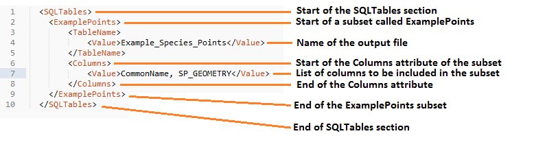

	Example of symbology set attributes configuration (MapInfo)

Desc
	An attribute describing the symbology set. This will appear in the interface drop-down list.

Symbology
	Each set contains only one child node ``<Symbology>>`` under which multiple symbols can be specified. set Each symbol is specified between <Symbol> and </Symbol> tags and is defined by the following child nodes:

Clause
	The clause that defines the records which will be assigned this symbol. This can be left blank to apply the symbology to all records with the same <Object> type specified below.

Object
	The object type that is symbolised using this symbol (e.g. ``Region``). Options are 'Point', 'Line' or 'Region'.

Symbol
	The style to be used for the symbol. This attribute only applies to ``Point`` objects.

Pen
	The style to be used for the symbol border (outline). This attribute applies to ``Region`` objects.

Brush
	The style to be used for the symbol infill. This attribute applies to ``Region`` objects.

	.. tip::
		In order to find the syntax for the Pen and Brush attribute, set the desired symbol for a polygon (region) layer through **Options => Region style**, then write ``Print CurrentBorderPen()`` in the MapBasic window and hit enter. The printed pen definition (e.g. ``2,2,10526880``) can be used in the ``Pen`` attribute.  Repeat with ``Print CurrentBrush()``.

.. caution::
	All entries in the configuration file are **case sensitive**. Most common errors in the setting up of the tool are caused by using the incorrect case for entries.

.. raw:: latex

   \newpage

.. index::
	single: Setting up the SQL database

Setting up the SQL Server database
==================================

In addition to any SQL tables containing records to be extracted using the Data Selector tool, an auxiliary table must also be present in the SQL Server database in order for the tool to be able to select data from tables held in SQL Server. This table is as follows:

_`Spatial_Tables` table
	This table contains information about any SQL data tables that may be used by the tool. The table has the following columns:

	.. tabularcolumns:: |L|L|

	.. table:: Valid date and time format specifiers

		+-----------------+-----------------------------------------------------------------------------------------------+
		|      Column     |                                          Description                                          |
		+=================+===============================================================================================+
		| TableName       | The name of the data table                                                                    |
		+-----------------+-----------------------------------------------------------------------------------------------+
		| OwnerName       | The database owner, usually ``dbo``                                                           |
		+-----------------+-----------------------------------------------------------------------------------------------+
		| XColumn         | The name of the column holding the X coordinates of the record                                |
		+-----------------+-----------------------------------------------------------------------------------------------+
		| YColumn         | The name of the column holding the Y coordinates of the record                                |
		+-----------------+-----------------------------------------------------------------------------------------------+
		| SizeColumn      | The name of the column holding the grid size of the record (in metres)                        |
		+-----------------+-----------------------------------------------------------------------------------------------+
		| IsSpatial       | Bitwise column (1 = Yes, 0 = No) defining whether the table is spatially enabled              |
		+-----------------+-----------------------------------------------------------------------------------------------+
		| SpatialColumn   | If the table is spatially enabled, the name of the geometry column (e.g. ``SP_GEOMETRY``)     |
		+-----------------+-----------------------------------------------------------------------------------------------+
		| SRID            | The name of the spatial reference system used to plot the records                             |
		+-----------------+-----------------------------------------------------------------------------------------------+
		| CoordSystem     | The coordinate system of the spatial data in the table                                        |
		+-----------------+-----------------------------------------------------------------------------------------------+
		| SurveyKeyColumn | The column containing the survey key for each record                                          |
		+-----------------+-----------------------------------------------------------------------------------------------+

	.. note::
		The British National Grid `SRID` value is
		``Earth Projection 8, 79, "m", -2, 49, 0.9996012717, 400000, -100000 Bounds
		(-7845061.1011, -15524202.1641) (8645061.1011, 4470074.53373)``

	.. caution::
		This table must be filled out correctly for each SQL table that is available to the Data Selector tool.

	.. note::
		A number of stored procedures that are used by the tool for selecting the required records must also be present in the SQL Server database. To obtain copies of these procedures please contact `Hester <mailto:Hester@HesterLyonsConsulting.co.uk>`_ or `Andy <mailto:Andy@AndyFoyConsulting.co.uk>`_.

.. raw:: latex

   \newpage

.. index::
	single: Installation

Installing the tool
===================

.. index::
	single: Installation; ArcGIS

Installing in ArcGIS
--------------------

Installing the tool in ArcGIS is straightforward. There are a few different ways it can be installed:

Installation through Windows Explorer
*************************************

Open Windows Explorer and double-click on the ESRI Add-in file for the Data Selector tool (:numref:`figInstallTool`).

.. _figInstallTool:

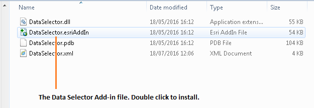

	Installing the Data Selector tool from Windows Explorer

.. raw:: latex

   \newpage

Installation will begin after confirming you wish to install the tool on the dialog that appears (:numref:`figConfirmInstall`).

.. _figConfirmInstall:

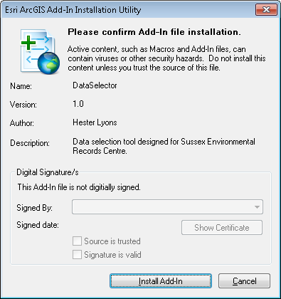

	Installation begins after clicking 'Install Add-in'

Once it is installed, it will become available to add to the ArcGIS interface as a button (see `CustomisingToolbarsArcGIS`_).

.. note::
	In order for this process to work all running ArcMap sessions must be closed. The tool will not install or install incorrectly if there are copies of ArcMap running.

.. raw:: latex

   \newpage

Installation from within ArcMap
*******************************

Firstly, open the Add-In Manager through the Customize menu (:numref:`figOpenAddInManager`).

.. _figOpenAddInManager:

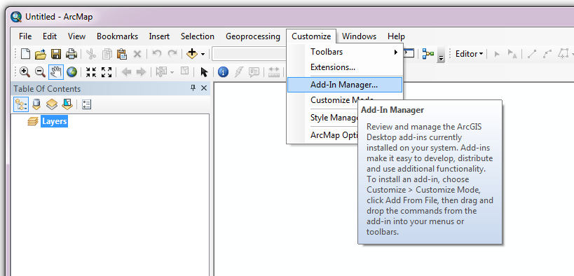

	Starting the ArcGIS Add-In Manager

.. raw:: latex

   \newpage

If the Data Selector tool is not shown, use the **Options** tab to add the folder where the tool is kept (:numref:`figAddInOptions`). The security options should be set to the lowest setting as the tool is not digitally signed.

.. _figAddInOptions:

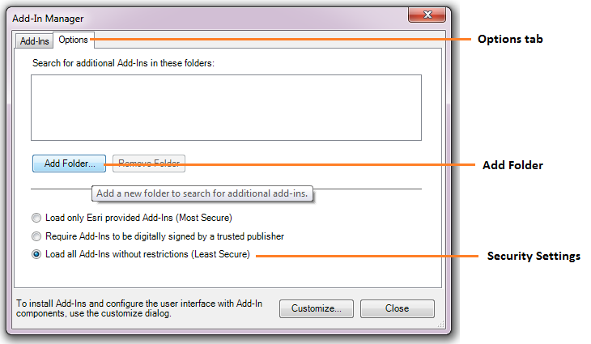

	The 'Options' tab in the ArcGIS Add-In Manager

Once the tool shows in the Add-In Manager (:numref:`figAddInManager`), it is available to add to the ArcGIS interface as a button (see `CustomisingToolbarsArcGIS`_).

.. _figAddInManager:

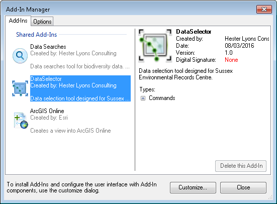

	The ArcGIS Add-In Manager showing the Data Selector tool

.. raw:: latex

   \newpage

.. _CustomisingToolbarsArcGIS:

Customising toolbars
********************

In order to add the Data Selector tool to the user interface, it needs to be added to a toolbar. It is recommended that this customisation is done inside a document, but it can be done so that the toolbar always appears in ArcGIS (see `Fundamentals of Saving your Customizations <http://desktop.arcgis.com/en/arcmap/10.3/guide-books/customizing-the-ui/fundamentals-of-saving-your-customizations.htm>`_ for an explanation of how customisations are stored within ArcGIS).

.. _figCustomizeMode:

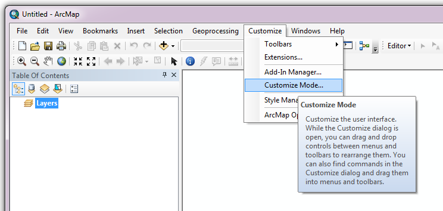

	Starting Customize Mode in ArcGIS

Customising toolbars is done through the Customize dialog, which can be started either through the Add-In Manager (by clicking **Customize**, see :numref:`figAddInManager`), or through choosing the 'Customize Mode...' option in the Customize Menu (:numref:`figCustomizeMode`).

.. raw:: latex

   \newpage

Once this dialog is open, select or clear the check box 'Create new toolbars and menus in the document' as required in the **Options** tab (:numref:`figCustomizeOptions`).

.. _figCustomizeOptions:

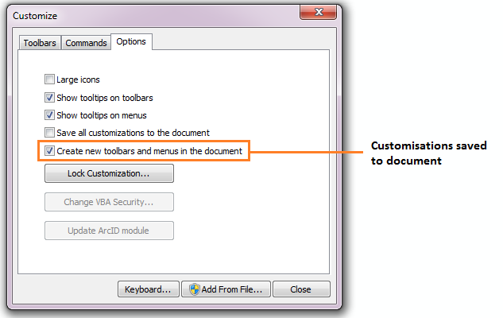

	Customising the document in ArcGIS

.. raw:: latex

   \newpage

It is recommended that the button for the Data Selector tool is added to a new toolbar. Toolbars are created through the **Toolbars** tab in the Customize dialog, as shown in figures :numref:`figCustomizeToolbars` and :numref:`figNameToolbar`.

.. _figCustomizeToolbars:

.. figure:: figures/CustomizeToolbarsAnnotated.png
	:align: center

	Adding a new toolbar in ArcGIS

.. _figNameToolbar:

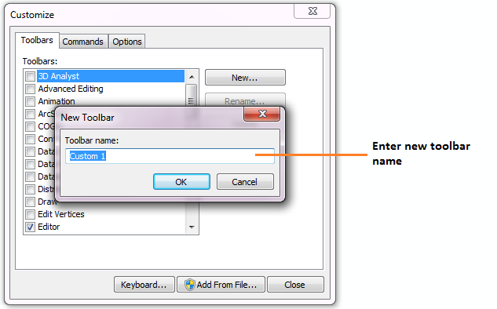

	Naming the new toolbar in ArcGIS

.. raw:: latex

   \newpage

Once a new toolbar is created and named, it is automatically added to the ArcMap interface as well as to the Customize dialog (:numref:`figNewToolbar`. In this case the toolbar was named 'TestToolbar'). 

.. _figNewToolbar:

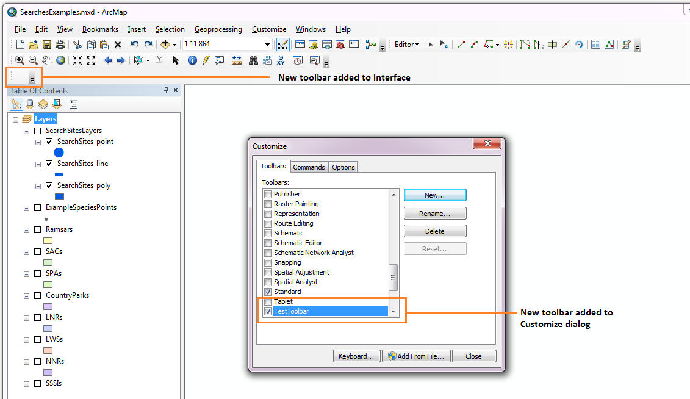

	New toolbar added to the ArcGIS Interface

.. raw:: latex

   \newpage

As a final step the Data Selector tool is added to the toolbar. This is done from the **Command** tab in the Customize dialog (:numref:`figAddInCommands`). Click on **Add-In Controls** and the Data Selector tool will be shown in the right-hand panel.

.. _figAddInCommands:

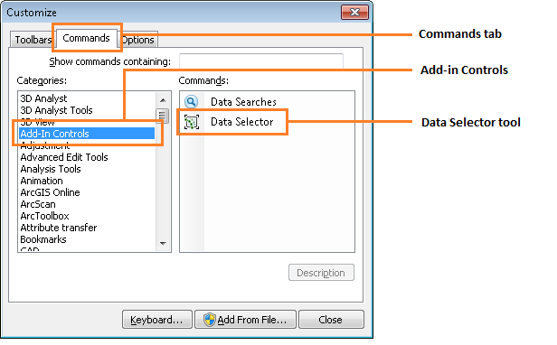

	Finding the Data Selector tool in the add-in commands

.. raw:: latex

   \newpage

To add the tool to the toolbar, simply drag and drop it onto it (:numref:`figDragDropTool`). Close the Customize dialog and **save the document**. The Data Selector tool is now ready for its final configuration and first use.

.. _figDragDropTool:

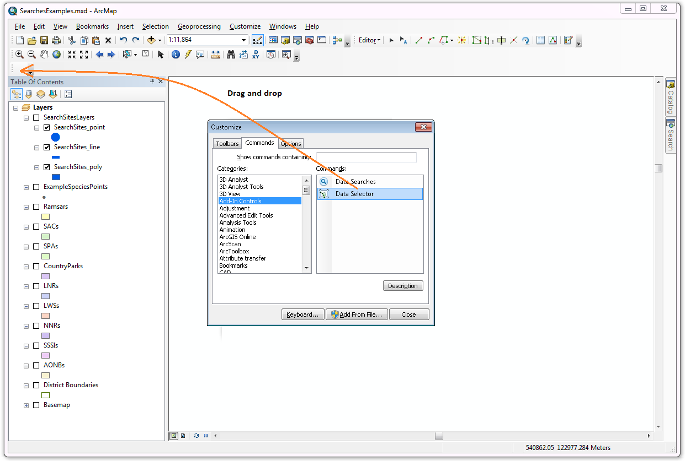

	Adding the Data Selector tool to the new toolbar

.. raw:: latex

   \newpage

In order to function, the tool needs to know the location of the XML configuration file. The first time the tool is run, or whenever the configuration file is moved, a dialog will appear asking for the folder containing the XML file (:numref:`figFirstStart`). Navigate to the folder where the XML file is kept and click **OK**. If the XML file is present and its structure is correct, the Data Selector form will be shown. Even if the tool is not run at this time, the location of the configuration file will be stored for future use.

.. _figFirstStart:

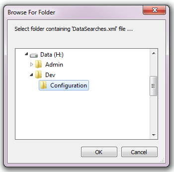

	Locating the configuration file folder

.. raw:: latex

   \newpage

.. index::
	single: Installation; MapInfo

Installing in MapInfo
---------------------

To install the tool in MapInfo, make sure that the configuration of the XML file as described above is complete, that the XML file is in the same directory as the tool MapBasic application (.MBX). Then, open `Tool Manager` in MapInfo by selecting :kbd:`Tools --> Tool Manager...` in the menu bar (:numref:`figToolManager`). 

.. _figToolManager:

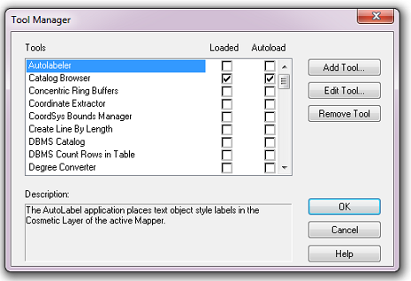

	The Tool Manager in MapInfo 12 or earlier

.. raw:: latex

   \newpage

In the `Tool Manager` dialog, click **Add Tool...**, then locate the tool using the browse button :kbd:`...` on the `Add Tool` dialog (:numref:`figAddTool`). Enter a name in the **Title** box (e.g. 'DataSelector'), and a description if desired. Then click **Ok** to close the `Add Tool` dialog.

.. _figAddTool:

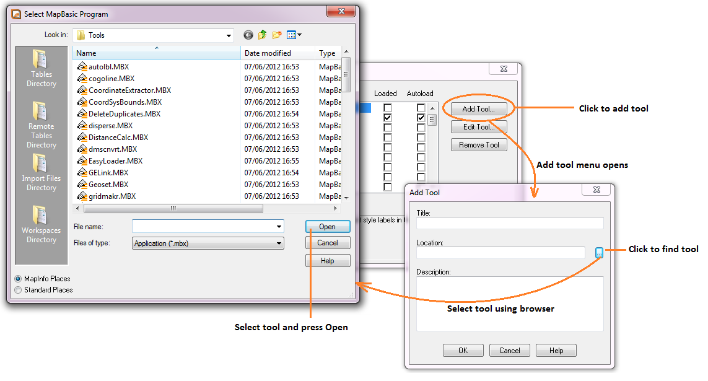

	Adding a tool in Tool Manager

.. raw:: latex

   \newpage

The tool will now show in the `Tool Manager` dialog (:numref:`figToolAdded`) and the **Loaded** box will be checked. To load the tool automatically whenever MapInfo is started check the **AutoLoad** box.  Then click **Ok** to close the `Tool Manager` dialog.

.. _figToolAdded:

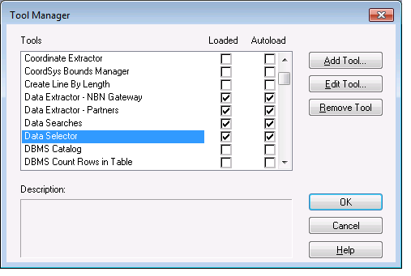

	The Data Selector tool is loaded

The tool will now appear as a new entry in the `Tools` menu (:numref:`figToolMenu`).

.. _figToolMenu:

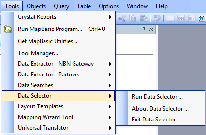

	The Data Selector tool menu

.. note::
	The name that will appear in the `Tools` menu is dependent on the `ToolTitle`_ value in the configuration file, **not** the name given when adding the tool using the Tool Manager.
